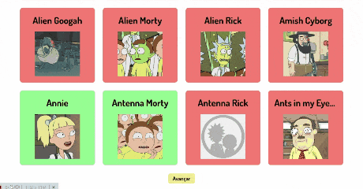

<h1>💻 RICK AND MORTY</h1>

 

Rick and Morty é uma aplicação em React que consome e realiza a paginação dos personagens a partir do consumo da api do Alex Fuhrmann. Os personagens são categorizados em duas cores, de acordo com sua condição na série, vivo ou morto.
 

<h1>🔨 RECURSOS</h1>

<ul>
<li><strong>Lista de personagens:</strong> os personagens fornecidos pela API são listados para o usuário.</li>
<li><strong>Paginação:</strong> são listados 20 personagens por página e o usuário pode ir ou voltar no sistema de paginação.</li>
<li><strong>Categorização:</strong> os personagens são categorizados dinamicamente  nas cores verde e vermelho de acordo com seu estado atual na série, vivo ou morto.</li>
<li><strong>Aplicação responsiva.</strong></li>
</ul> 

<h1>🚀 TECNOLOGIAS</h1>

<ul>
<li>JAVASCRIPT</li>
<li>HTML</li>
<li>CCS</li>
<li>REACT</li>
<li>CONSUMO DE API</li>
<li>AXIOS</li>
<li>STYLED-COMPONENTS</li>
</ul> 

<h1>🔗 LINK</h1>

<a href="https://react-atividade-s1-buscando-mais-persona-elizeu-vasconcelos1992.vercel.app/" target="_blank">LINK PARA RICK AND MORTY</a>
